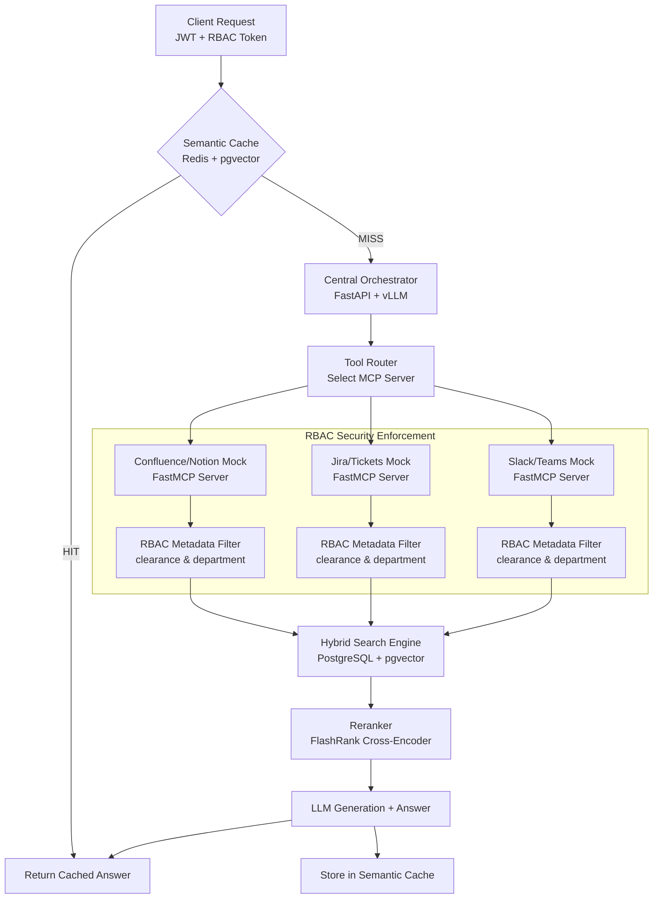

# Zero-Trust Retrieval-Augmented Generation (RAG)

A secure, enterprise-grade RAG pipeline implementing Role-Based Access Control (RBAC) at the document level. This project secures information retrieval across mock enterprise endpoints (Confluence, Jira, Slack) via Model Context Protocol (MCP) servers, backed by a hybrid search engine (BM25 + pgvector), semantic caching, reranking, and automated evaluation.

---

## Architecture Overview

This system enforces zero-trust data retrieval. Documents are indexed with department and clearance metadata, and queries are evaluated against user credentials before data is retrieved and fed to the LLM.



### Key Workflow Steps
1. **Client Request**: The client sends a query with a JWT token containing their identity, department (e.g., `Marketing`, `Engineering`), and clearance level (e.g., `1` for Intern, `3` for Exec).
2. **Semantic Cache Check**: Redis is checked for semantically similar queries using pgvector-based distance thresholds. If a match is found, the cached response is returned immediately.
3. **Orchestration & Query Expansion**: FastAPI receives cache misses, performs query expansion via HyDE (Hypothetical Document Embeddings), and maps query intents to the appropriate tool (MCP server).
4. **Model Context Protocol (MCP) Clients & Servers**: The orchestrator communicates with dedicated FastMCP servers (Confluence, Jira, Slack) over SSE or WebSockets.
5. **RBAC Filtering**: Data retrieval queries to the Vector Database are injected with metadata filters matching the user's department and clearance level, ensuring unauthorized data is never exposed.
6. **Hybrid Retrieval**: PostgreSQL with pgvector processes combined BM25 keyword searches and dense vector searches (BGE-Large-en-v1.5), combining results using Reciprocal Rank Fusion (RRF).
7. **Reranking**: The top 20 retrieved chunks are refined by a FlashRank cross-encoder down to the top 5 most relevant chunks.
8. **Generation**: The context-grounded response is synthesized by the LLM and stored in Redis for future hits.

---

## Project Structure

```
zero-trust-rag/
├── docker-compose.yml       # PostgreSQL (pgvector), Redis, and service configurations
├── .env.example             # Template for local environment variables
├── requirements.txt         # Project-wide Python dependencies
├── orchestrator/
│   ├── main.py              # FastAPI Application (MCP Client & API gateway)
│   ├── rbac.py              # JWT Middleware & permission claims checks
│   ├── hyde.py              # HyDE (Hypothetical Document Embeddings) expansion
│   ├── semantic_cache.py    # Redis-based semantic cache
│   └── router.py            # Tool routing & selection logic based on query intent
├── mcp_servers/
│   ├── confluence_server.py # FastMCP server mock for Confluence / Notion
│   ├── jira_server.py       # FastMCP server mock for Jira / Tickets
│   └── slack_server.py      # FastMCP server mock for Slack / Teams
├── vector_db/
│   ├── embeddings.py        # Dense embeddings using bge-large-en-v1.5
│   ├── hybrid_search.py     # Unified BM25 + pgvector search with RRF combination
│   └── reranker.py          # Cross-encoder reranking via FlashRank
├── data/
│   ├── seed_confluence.py   # Seeding scripts for Mock Confluence documents
│   ├── seed_jira.py         # Seeding scripts for Mock Jira tickets
│   └── seed_slack.py        # Seeding scripts for Mock Slack channels and DMs
├── evaluation/
│   └── ragas_eval.py        # RAGAS metrics evaluation (faithfulness, correctness)
└── tests/
    └── test_rbac.py         # Access control & JWT verification tests
```

---

## Setup & Installation

### Prerequisites
- Python 3.10+
- Docker & Docker Compose
- Virtualenv or Conda (recommended)

### 1. Clone & Initialize Environment
```bash
git clone <your-repo-url> zero-trust-rag
cd zero-trust-rag
cp .env.example .env
```

### 2. Set Up Virtual Environment & Dependencies
```bash
python3 -m venv venv
source venv/bin/activate
pip install --upgrade pip
pip install -r requirements.txt
```

### 3. Spin Up Infrastructure
Start the PostgreSQL (with pgvector) and Redis services using Docker Compose:
```bash
docker-compose up -d
```

### 4. Database Seeding
Index the mock enterprise data into the vector database:
```bash
python data/seed_confluence.py
python data/seed_jira.py
python data/seed_slack.py
```

### 5. Running the Application
Start the FastAPI orchestrator and the MCP servers:
```bash
# Start MCP servers (in separate terminals or run in background)
fastmcp dev mcp_servers/confluence_server.py
fastmcp dev mcp_servers/jira_server.py
fastmcp dev mcp_servers/slack_server.py

# Start the orchestrator API
uvicorn orchestrator.main:app --reload --port 8000
```

---

## Detailed Component Specifications

### 1. Security & RBAC (`orchestrator/rbac.py`, `tests/test_rbac.py`)
- Claims format:
  ```json
  {
    "sub": "user_id",
    "department": "Engineering",
    "clearance_level": 2
  }
  ```
- Any fetch to hybrid search must append a SQL/Metadata filter equivalent to:
  `WHERE department = :dept AND clearance_level <= :clearance`

### 2. Semantic Cache (`orchestrator/semantic_cache.py`)
- Saves target query and generated answers in Redis.
- Performs cosine similarity on input query embeddings. Returns cached response if similarity exceeds a designated threshold (e.g., `0.92`).

### 3. Hybrid Search (`vector_db/hybrid_search.py`)
- Combined sparse/dense retrieval.
- BM25 full-text queries are executed alongside pgvector cosine distance lookups.
- **Reciprocal Rank Fusion (RRF)** scales results to match relevancy across indexing systems.

---

## Licensing & Contributions
This project is open-source under the MIT License.
